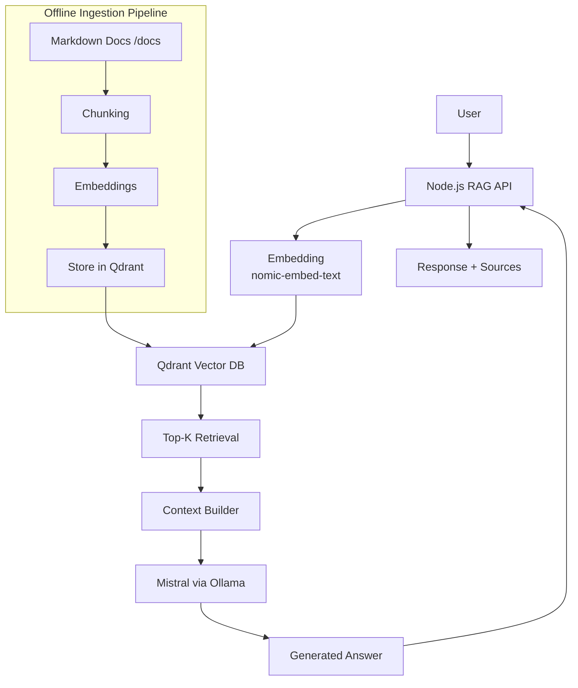

# 🧠 Kerloper Agentic RAG System

A lightweight, production-structured Retrieval-Augmented Generation (RAG) system for querying internal financial knowledge using local AI models.

This project demonstrates an end-to-end AI system design using:
- Vector search (Qdrant)
- Local LLM inference (Ollama + Mistral)
- Embedding model (nomic-embed-text)
- Clean API architecture (Node.js)

---

# 📌 System Overview

The system converts static markdown documentation into an AI-accessible knowledge base and allows users to query it using natural language.

---

# 🧠 Architecture

## 🔷 Full System Design



---

# ⚙️ Tech Stack

- Node.js (Backend API)
- Express.js (REST layer)
- Qdrant (Vector Database)
- Ollama (Local LLM runtime)
- Mistral (Answer generation)
- nomic-embed-text (Embeddings)

---

# 📁 Project Structure

```
src/
  routes/        → API endpoints
  services/      → RAG pipeline logic
  db/            → Qdrant integration
  config.js      → System configuration

core/
  rag/           → Retrieval & embedding logic
  llm/           → Prompt + model layer
  utils/         → Helpers

agentic-brain/
  PROJECT_BRIEF.md
  AGENT_CONTEXT.md
  MEMORY.md
  TASKS.md
  EVALS.md

docs/            → Knowledge base (Markdown files)
```

---

# 🚀 How It Works

## 1. Ingestion (Offline)

- Load markdown files from `/docs`
- Split into chunks
- Generate embeddings (nomic-embed-text)
- Store vectors in Qdrant with metadata

## 2. Query Flow (Online)

- User sends question to `/api/ask`
- Question is embedded
- Qdrant retrieves top-k relevant chunks
- Context is built from retrieved data
- Mistral generates final grounded response

---

# 🔌 API

## POST `/api/ask`

### Request
```json
{
  "question": "What is risk scoring in Kerloper?"
}
```

### Response
```json
{
  "answer": "Risk scoring is calculated based on volatility, liquidity, and diversification.",
  "sources": [
    "risk-policy.md"
  ]
}
```

---

# 🧠 Key Design Principles

## 1. Retrieval-first architecture
The system never relies on model memory alone — all answers are grounded in retrieved documents.

## 2. Deterministic behavior
System is designed to reduce hallucinations through strict prompt constraints.

## 3. Separation of concerns
- API layer → request handling
- Core layer → AI logic
- DB layer → vector storage

## 4. Local-first AI stack
No external APIs required — everything runs locally via Ollama.

---

# 🔒 Guardrails

- Use ONLY retrieved context
- No external knowledge
- No financial advice or predictions
- Return "Not found in knowledge base" when context is insufficient

---

# 🧪 Example Use Cases

- What is risk scoring system?
- What services does Kerloper provide?
- How does account verification work?
- What are compliance policies?

---

# 📊 Why this architecture?

This system prioritizes:
- Explainability over complexity
- Retrieval accuracy over model size
- Traceability over autonomy

---

# 📈 Future Improvements (Not implemented)

- Hybrid search (BM25 + vector)
- Reranking layer
- Conversation memory
- Streaming responses

---

# 🏁 Summary

This is not just a chatbot.

It is a retrieval-driven financial knowledge system with traceable AI reasoning.
